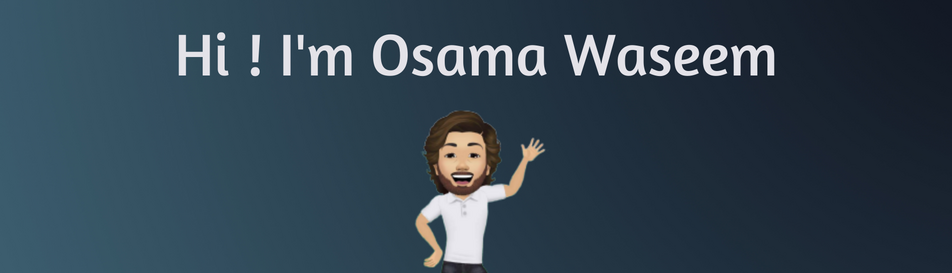

 

# Hi there 👋, I'm Osama Khan

🚀 Full Stack JavaScript Engineer with 5+ years of experience building scalable Web2, Web3, and AI-powered applications.

I specialize in creating high-performance products using modern JavaScript/TypeScript ecosystems — from interactive SaaS platforms and blockchain integrations to AI automations and RAG pipelines.

Currently exploring and contributing to the AI space with LLM applications, n8n automations, and retrieval-based systems.

### 🛠️ What I Work With

* Frontend: React.js, Next.js
* Backend: Node.js, NestJS, GraphQL
* Databases: MongoDB, PostgreSQL
* Web3: EVM, Solana, Smart Contracts
* AI: RAG Pipelines, LLM Integrations, Automations

### 🌱 Current Focus

* AI Engineering & Agentic Workflows
* Automation Systems with n8n
* Scalable Full Stack Architectures

### 🤝 Open To

Collaborating on impactful AI, SaaS, and Web3 products.

💬 Ask me about Full Stack Development, Web3, AI Automations, or scalable JavaScript architectures.

📌 Projects: [github.com/osamaKhan99](https://github.com/osamaKhan99?tab=repositories)

