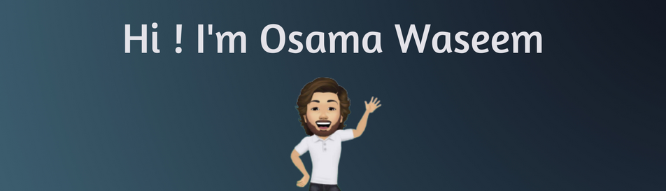

 

👨‍💻 Computer Science grad & JavaScript Developer passionate about using my skills to make a difference in IT. I love tackling real-world problems and am always eager to share what I know. Let's build something amazing together! 🚀

### 🧐 More About Me:

- 🔭   I’m currently working on ReactJs, NestJs, Web3.js
- 🤠  I’m looking to collaborate on Web3.0
- 🌱   I’m currently learning Blockchain, DeFi, SubGraph
- 👨🏻‍💻   Most of my projects are available [here](https://github.com/osamaKhan99?tab=repositories)
- 💬   Ask me about anything tech related, I am happy to help;

<a href='https://github.com/rahul-jha98/github-stats-transparent'>
 

</a>
